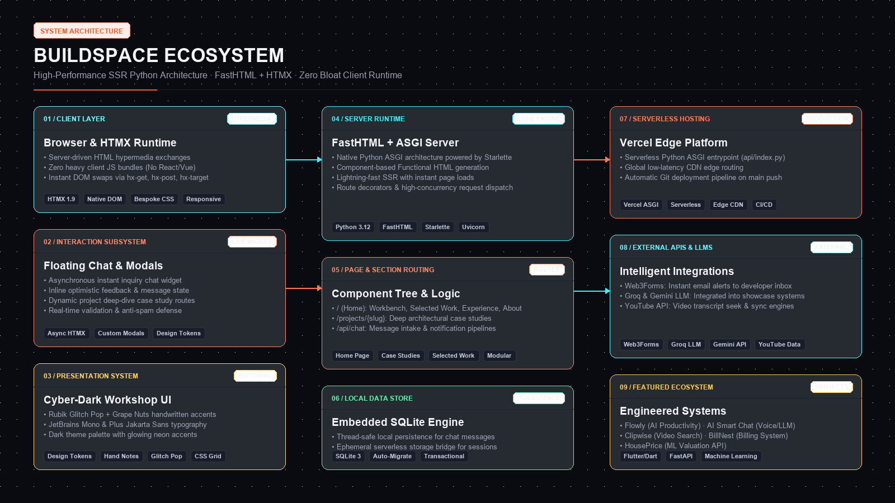

# 🧱 BUILDSPACE

> **Personal Developer Ecosystem & Open Engineering Workshop**  
> **Built by Suyash Rane** — AI Engineer & Product Builder  
> **Live Web:** [https://buildspace-kohl.vercel.app/](https://buildspace-kohl.vercel.app/)

---

## ⚡ Overview

**BuildSpace** is a living developer ecosystem and engineering portfolio built with **Python 3.12**, **FastHTML**, **HTMX**, and a custom **Modern CSS Design System**. It replaces generic, static portfolio templates with a live engineering workshop showcasing ongoing software experiments, deep architectural retrospectives, an active experience timeline, and an interactive direct inbox chat widget.

---

## 🏛️ Architecture & Sections



* **`01 / WORKBENCH`**: Hero manifesto (*I DESIGN. I BUILD. I SHIP.*), portrait card, and live workbench panel.
* **`02 / SELECTED WORK`**: Curated catalog of 6 systems, tools & experiments with deep-dive case study pages at `/projects/{slug}`:
  * `01 / BUILDSPACE` (Developer Ecosystem — FastHTML + SQLite)
  * `02 / CLIPWISE` (Full-Stack Video Transcript Timestamp Search SaaS)
  * `03 / FLOWLY` (AI‑Powered Productivity & Task Management App — Flutter + Groq LLM)
  * `04 / AI SMART CHAT` (Multilingual Voice & LLM Chat App — Flutter + Gemini/Groq)
  * `05 / BILLNEST` (Django Invoice & Billing Automation Web System)
  * `06 / HOUSEPRICE API` (FastAPI ML Property Valuation Service & Streamlit UI)
* **`03 / EXPERIENCE`**: High-contrast editorial timeline detailing engineering roles at **Patch ID**, **Voltup**, **Mask Polymers**, and **Prepway Solutions**.
* **`04 / ABOUT`**: Developer manifesto, academic credentials at NMIET Pune (CGPA 8.25), hackathon achievements, categorized skill toolbox (Python, Dart, Flutter, FastAPI, RAG, etc.), and certifications.
* **`05 / CONNECT`**: Direct channels to GitHub, LinkedIn, Email, and Twitter/X.
* **💬 INTERACTIVE CHAT WIDGET**: Floating asynchronous messenger powered by HTMX that stores inquiries locally in SQLite and forwards them directly to email.

---

## 🛠️ Tech Stack

* **Backend & SSR**: Python 3.12, FastHTML, ASGI / Uvicorn
* **Interactions**: HTMX (Zero heavy client JS frameworks)
* **Persistence**: Embedded SQLite (`chat_messages.db`)
* **Styling**: Pure Bespoke CSS with CSS Variables and Design Tokens
* **Deployment**: Vercel Serverless (Python ASGI runtime) / Railway / Docker ready

---

## 🚀 Running Locally

```bash
# 1. Install dependencies
pip install -r requirements.txt

# 2. Run the development server
python main.py
```
Open [http://localhost:5001](http://localhost:5001) in your browser.

---

## ⚙️ Environment Configuration (Optional)

To enable live email forwarding from the chat widget to your inbox, create a `.env` file (refer to `.env.example`):

```env
# Free Web3Forms Key (Recommended)
WEB3FORMS_KEY=your_web3forms_key_here
```
